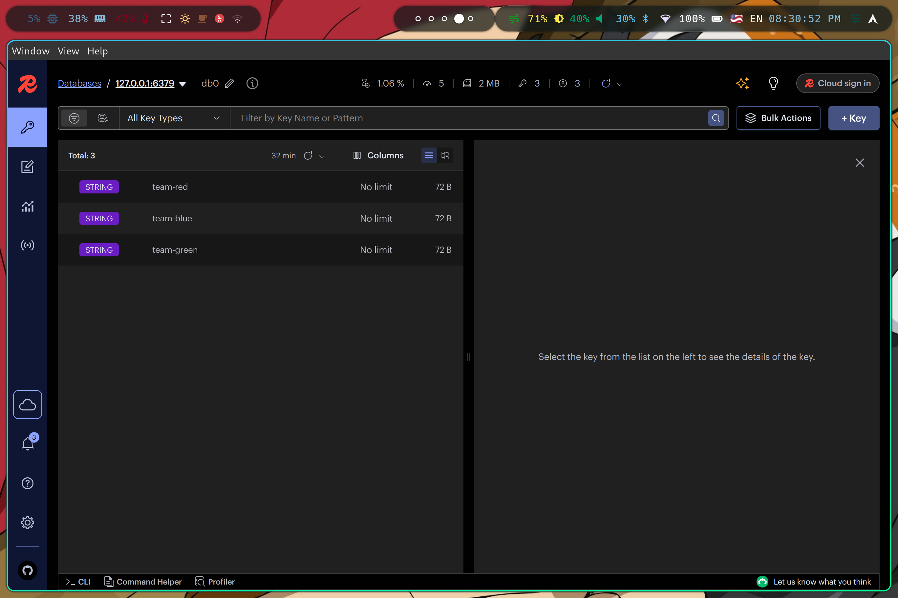
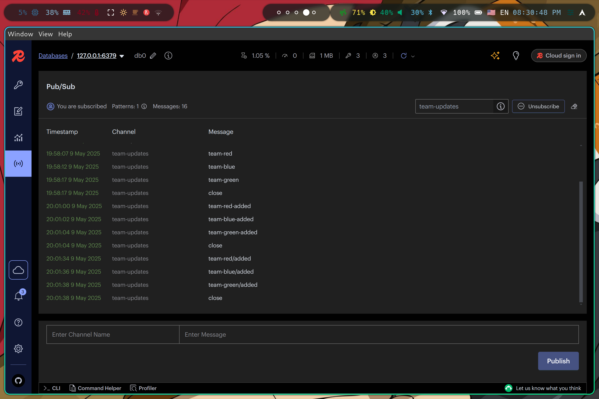

## Problem 2: Redis

IUTBox link:
<br />
[https://iutbox.iut.ac.ir/index.php/s/f74MfCTo7LRCokG](https://iutbox.iut.ac.ir/index.php/s/f74MfCTo7LRCokG)
<br />

First we need to run a redis container:

```bash
docker run -d \
    --name msg_broker \
    -p 6379:6379 \
    redis:7.4-alpine
```

we exposed the port to be accessible from outside.

then we need to make a virtual environment to install redis python package:

```bash
python3 -m venv venv
source venv/bin/activate
pip install redis
```

### About Reciever and Publisher

Publisher sets a key/value every 2 seconds and assign 3 keys totally, also publishes a messages on "team-updates"
channel whenever a new key is set, in the other hand reciever subscribe to the "team-updates" channel and extract the new key/value from the
message published on the channel and print it.
<br />
The reciever doesn't stop, publisher publishes a message containing "close" to signal the reciever that
the operation is done, after recieving the "close" message reciever breaks out of the loop.
<br />

### Running

first we need to run reciever.py:

```bash
python3 reciever.py
```

then:

```bash
python3 publisher.py
```

both codes communicate with each other through redis and notify each other via pub/sub feature.

### Monitoring

We used RedisInsight to monitor redis, we installed it from source using yay which is a tool only
available on Arch Linux but for other distributions its a bit simpler:

```bash
yay -S redisinsight
```

it takes a long time to install, after installing we can check the key/valus while the codes are running:

as shown in the picture, keys are added by publisher code also while we are running the code the pub/sub
looks like this:

which shows the messages on the "team-updates" channel.
