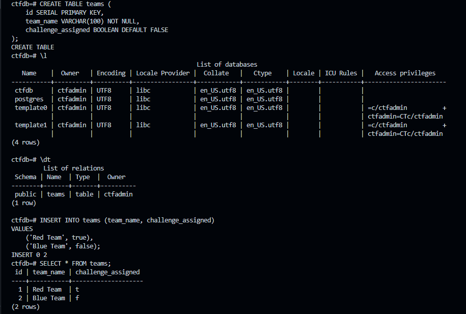

# Phase 1 - PostgreSQL Deployment with Persistent Storage

This part of the CTF infrastructure deployment demonstrates how to set up a PostgreSQL container with persistent storage and perform basic database operations. It also verifies that the data remains intact across container restarts.

# 🔧 Step-by-Step Setup Instructions

## 1. Run a PostgreSQL Container with Persistent Volume

We use a **named Docker volume** to ensure PostgreSQL data persists even if the container is removed.

```bash
# Create a Docker volume for persistence
docker volume create pgdata

# Run PostgreSQL container with volume mounted
docker run -d \
  --name my_postgres \
  -e POSTGRES_USER=ctfadmin \
  -e POSTGRES_PASSWORD=ctfpass \
  -e POSTGRES_DB=ctfdb \
  -v pgdata:/var/lib/postgresql/data \
  -p 5432:5432 \
  postgres:latest
```
This creates a container named `my_postgres` using a named volume `pgdata` to persist PostgreSQL data.

## 2. Connect to PostgreSQL and Perform SQL Operations

### Connect using `psql`:
```bash
docker exec -it my_postgres psql -U ctfadmin -d ctfdb
```
### Execute SQL commands:
```sql
-- Create a table to store team information
CREATE TABLE teams (
    id SERIAL PRIMARY KEY,
    team_name VARCHAR(100) NOT NULL,
    challenge_assigned BOOLEAN DEFAULT FALSE
);

-- Insert sample data into the table
INSERT INTO teams (team_name, challenge_assigned)
VALUES 
    ('Red Team', true),
    ('Blue Team', false);

-- Retrieve all records from the table
SELECT * FROM teams;

-- Update a team's challenge assignment status
UPDATE teams
SET challenge_assigned = true
WHERE team_name = 'Blue Team';

-- Delete a team from the table
DELETE FROM teams
WHERE team_name = 'Red Team';
```
### Expected output:


## 3. Test Persistence

### a. Stop and remove the container:

```bash
docker stop my_postgres
docker rm my_postgres
```

### b. Re-launch container with same volume:
```bash
docker run -d \
  --name my_postgres \
  -e POSTGRES_USER=ctfadmin \
  -e POSTGRES_PASSWORD=ctfpass \
  -e POSTGRES_DB=ctfdb \
  -v pgdata:/var/lib/postgresql/data \
  -p 5432:5432 \
  postgres:latest
```

### c. Reconnect and confirm data is still there:
```bash
docker exec -it my_postgres psql -U ctfadmin -d ctfdb

-- Inside psql:
SELECT * FROM flags;
```