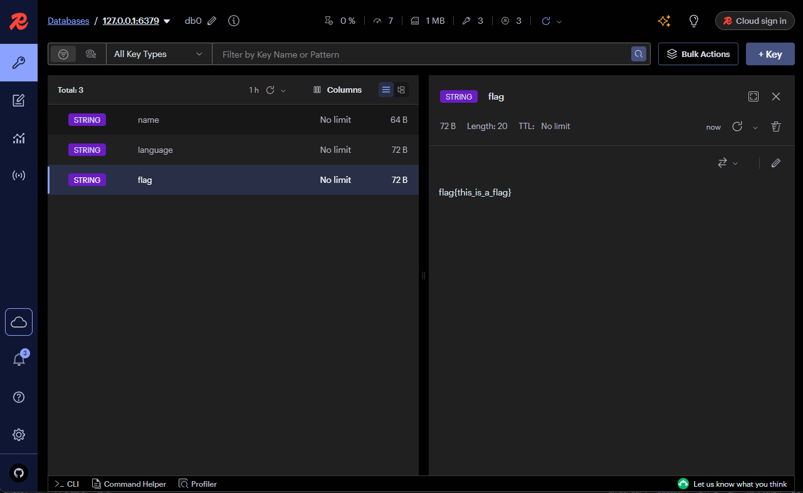

# Phase 2 - Redis Server Setup

This phase covers deploying a Redis server in Docker, performing basic Redis operations, and implementing inter-process communication using Redis with Python. Additionally, it includes monitoring Redis activity using a Redis Insight tool and documenting the process.

## 1. Deploy Redis Server in Docker

### Launch Redis Server in Docker:

Run the Redis server inside a Docker container:

```bash
docker run -d \
  --name my_redis \
  -p 6379:6379 \
  redis:latest
```
This command runs Redis in detached mode (`-d`) and maps the default Redis port (6379) to the host system.

### Verify Redis Server is Running:
To confirm that Redis is running and accepting connections, use the following command:

```bash
docker exec -it my_redis redis-cli ping
```

The expected output is this:
```bash
PONG
```

# 2. Implement Inter-Process Communication Using Redis

### Python Program 1: Set Key-Value Pairs and Publish Messages

Create a Python script `publisher.py` that sets multiple key-value pairs in Redis and publishes messages to a Redis channel.

### Python Program 2: Retrieve Key-Value Pairs and Subscribe to a Channel

Create a second Python script `subscriber.py` to retrieve the key-value pairs and subscribe to the same Redis channel.

before running anything we should install requirements:

creating virtual environment for python:
```bash
python -m venv .venv
```

and now installing requirements:
```bash
source .venv/bin/activate
```

and now we can run `publisher.py` and then `subscriber.py` to see the results.

## Redis Insight Results

