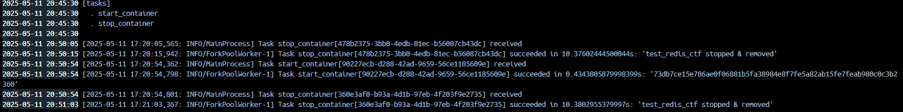

# Phase 3 - Celery Setup
This setup manually runs a Celery-based infrastructure using Docker containers (without docker-compose). Redis is used as both the broker and backend for Celery.

### 1. Create a Custom Docker Network

To allow communication between containers by name, we first create an isolated Docker network:

```bash
docker network create ctf-net
```
This network (`ctf-net`) will be shared by all containers so they can resolve each other by name (e.g., `redis`).


### 2. Run Redis Container

Launch a Redis container in detached mode and attach it to the custom network:

```bash
docker run -d \
--name redis \
-p 6379:6379 \
--network ctf-net \
redis:latest
```
+ `-p 6379:6379` exposes Redis for external testing if needed.

+ `--network ctf-net` connects it to the custom network.

✅ Redis will be accessible inside other containers via hostname `redis`.


### 3. Build Celery Worker Image
This builds the image that will run the Celery worker using a custom `Dockerfile.worker`:

```bash
docker build -f Dockerfile.worker -t celery_worker .
```

+ -f Dockerfile.worker tells Docker which Dockerfile to use.

+ -t celery_worker tags the resulting image.


### 4. Build Celery Test Image

This builds a separate container for testing or triggering Celery tasks:

```bash
docker build -f Dockerfile.test -t celery_tester .
```

This is useful for simulating client applications that submit tasks.


### 5. Run Celery Worker Container

Start the worker container and attach it to the same network:

```bash
docker run -d \
--name celery_worker_container \
-v /var/run/docker.sock:/var/run/docker.sock \
--restart=always \
--network ctf-net \
celery_worker
```
`--restart=always`: ensures the worker auto-restarts if it crashes.

`-v /var/run/docker.sock:/var/run/docker.sock`: mounts Docker socket (e.g., if the worker needs Docker control — e.g., in CTF environments).

`--network ctf-net`: ensures access to redis.


### 6. Run Celery Tester Container
Launch a container that can send tasks to the worker:


```bash
docker run -d \
--name celery_tester_container \
-v /var/run/docker.sock:/var/run/docker.sock \
--restart=no \
--network ctf-net \
celery_tester
```

+ This container can use Python scripts (e.g., calling `.delay()` on a task).

+ `--restart=no` disables auto-restart, which is fine for short-lived task triggers.

## Results


