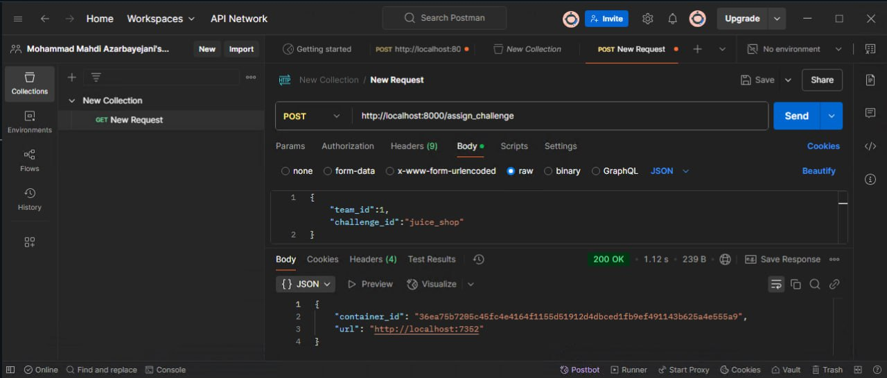
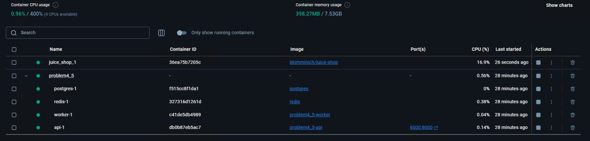
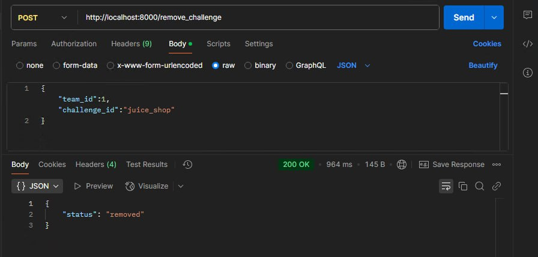
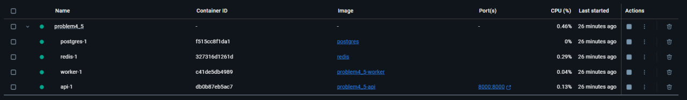

```markdown
# 🎯 فاز چهارم - مدیریت چالش‌های CTF با FastAPI و Celery

در این مرحله، یک وب‌سرویس با FastAPI پیاده‌سازی شده که امکان اختصاص چالش‌های امنیتی (مثل Juice Shop یا ToDo App) به تیم‌ها را به‌صورت خودکار فراهم می‌کند. کانتینرها به کمک Docker و به‌صورت ایزوله اجرا شده و کنترل آن‌ها از طریق Celery انجام می‌شود.


```
## 📁 ساختار پروژه

```
Problem4/
├── api/                       # اپلیکیشن FastAPI
│   ├── main.py                # Endpointها و منطق API
│   ├── models.py              # مدل دیتابیس
│   ├── database.py            # اتصال به PostgreSQL با SQLAlchemy
│   ├── celery_app.py          # تنظیمات Celery
│   ├── requirements.txt       # وابستگی‌های API
│   └── Dockerfile             # Dockerfile مربوط به API
├── worker/                    # پردازشگر وظایف Celery
│   ├── celery_tasks.py        # تعریف وظایف celery برای اجرای کانتینر
│   ├── requirements.txt       # وابستگی‌های Worker
│   └── Dockerfile             # Dockerfile مربوط به Worker
├── docker-compose.yml         # راه‌اندازی تمام سرویس‌ها با هم
└── README.md                  
```


## 🔌 آدرس‌های API

### 1. `POST /assign_challenge`

درخواست ایجاد کانتینر چالش برای یک تیم مشخص.

```json
{
  "team_id": 1,
  "challenge_id": "juice_shop"
}
```

پاسخ:

```json
{
  "container_id": "af4d2e4f58...",
  "url": "http://localhost:7352"
}
```

---

### 2. `POST /remove_challenge`

درخواست حذف کانتینر اختصاص‌یافته به یک تیم.

```json
{
  "team_id": 1,
  "challenge_id": "juice_shop"
}
```

پاسخ:

```json
{
  "status": "removed"
}
```


## 🧪 روش اجرای پروژه

### 1. اجرای سیستم:

```bash
docker-compose up --build
```

---

### 2. تست با curl:

📌 اختصاص چالش:
```bash
curl -X POST http://localhost:8000/assign_challenge \
  -H "Content-Type: application/json" \
  -d '{"team_id": 1, "challenge_id": "juice_shop"}'
```


()
()


📌 حذف چالش:
```bash
curl -X POST http://localhost:8000/remove_challenge \
  -H "Content-Type: application/json" \
  -d '{"team_id": 1, "challenge_id": "juice_shop"}'
```

()
()

## 🧼 پاک‌سازی پروژه

برای حذف کامل سرویس‌ها و دیتا:

```bash
docker-compose down -v
```


## ویدیوی توضیحات 
https://iutbox.iut.ac.ir/index.php/s/t3FPnGWk7RzoWGj
