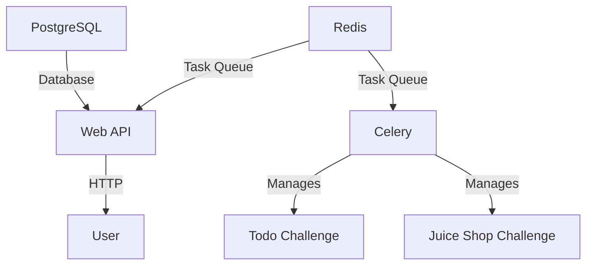
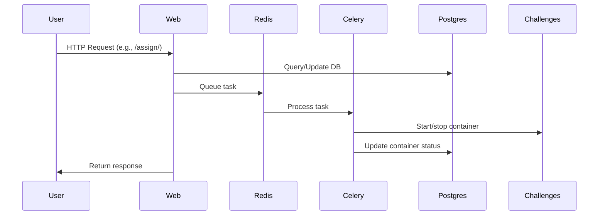

# CTF Challenge Management Web API - Docker Compose Integration

## 🐳 Docker Compose Setup

```yaml
version: '3.8'

services:
  postgres:
    image: postgres:latest
    environment:
      - POSTGRES_USER=ctf_user
      - POSTGRES_PASSWORD=ctf_password
      - POSTGRES_DB=ctf_db
    ports:
      - "5432:5432"
    volumes:
      - pgdata:/var/lib/postgresql/data
    networks:
      - ctf_network

  redis:
    image: redis:latest
    ports:
      - "6379:6379"
    networks:
      - ctf_network

  web:
    build: .
    command: gunicorn --bind 0.0.0.0:8000 ctf_api.wsgi:application
    volumes:
      - .:/app
    ports:
      - "8000:8000"
    environment:
      - DJANGO_SETTINGS_MODULE=ctf_api.settings
    depends_on:
      - postgres
      - redis
    networks:
      - ctf_network

  celery:
    build: .
    command: celery -A ctf_api worker --loglevel=info
    volumes:
      - .:/app
      - /var/run/docker.sock:/var/run/docker.sock
    environment:
      - DJANGO_SETTINGS_MODULE=ctf_api.settings
    depends_on:
      - postgres
      - redis
    networks:
      - ctf_network

  challenge_todo:
    image: jetty:9.4-jre11-slim
    ports:
      - "14480:8080"
    networks:
      - ctf_network
    deploy:
      replicas: 0  # Managed by API

  challenge_juice:
    image: bkimminich/juice-shop
    ports:
      - "14528:3000"
    networks:
      - ctf_network
    deploy:
      replicas: 0  # Managed by API

networks:
  ctf_network:
    driver: bridge

volumes:
  pgdata:
```

---

## Core Components

| Service         | Role                                      | Key Details                                  |
|-----------------|-------------------------------------------|---------------------------------------------|
| **PostgreSQL**  | Persistent database for teams/challenges  | - Credentials: `ctf_user`/`ctf_password`<br>- Data persistence via `pgdata` volume |
| **Redis**       | Message broker for Celery tasks           | - Handles asynchronous container operations |
| **Web API**     | Django/Gunicorn HTTP server               | - Exposes port `:8000`<br>- Connects to PostgreSQL and Redis |
| **Celery**      | Async container management worker         | - Requires Docker socket access<br>- Starts/stops challenge containers |
| **Challenges**  | Pre-built CTF containers                  | - Start with 0 replicas (disabled by default)<br>- Fixed host ports: `14480` (Todo), `14528` (Juice Shop) |

---


## 🏗️ System Architecture

### Component Diagram


### Workflow Sequence


1. **User** makes API request to Web service
2. **Web** updates PostgreSQL and queues task in Redis
3. **Celery** processes task and manages containers
4. **Status updates** flow back through the chain

---
## 🚀 System Initialization and Operation

### Prerequisites
- Docker
- Docker Compose
- Postman

### Step-by-Step
1. Place `docker-compose.yml` in your directory.
2. Run: `docker-compose up --build`
3. Apply migrations: `docker exec ctf_web_1 python manage.py makemigrations` and `migrate`
4. Add data:
   ```bash
   docker exec -it ctf_web_1 python manage.py shell
   ```
   ```python
   from challenges.models import Team, Challenge
   Team.objects.create(team_id="team1", name="Team1")
   Team.objects.create(team_id="team2", name="Team2")
   Challenge.objects.create(challenge_id="todo", name="Todo App", image="jetty:9.4-jre11-slim", port=8080)
   Challenge.objects.create(challenge_id="juice", name="Juice Shop", image="bkimminich/juice-shop", port=3000)
   exit()
   ```
5. Check containers: `docker ps`
6. Test API with Postman.

### API Testing via Postman
- **Assign**:
  - Team2 - Juice Shop: `POST /api/assign/ { "team_id": "team2", "challenge_id": "juice" }`
  - Team1 - Todo App: `POST /api/assign/ { "team_id": "team1", "challenge_id": "todo" }`
- **Remove**: `DELETE /api/remove/ { "team_id": "team2", "challenge_id": "juice" }`
- **List**: `GET /api/list/`

---

## 🎥 Video Demonstration

📎 [Click here to view the video](https://iutbox.iut.ac.ir/)

> Shows:
>
> * Run `docker-compose up --build` and `docker ps`.
> * Assign Team1 (Todo) and Team2 (Juice) via Postman, check `docker ps`.
> * Remove Team2 (Juice) via Postman, verify removal.
> * Show `docker logs ctf_celery_1` for container logs.


