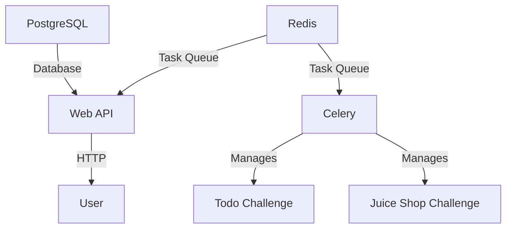
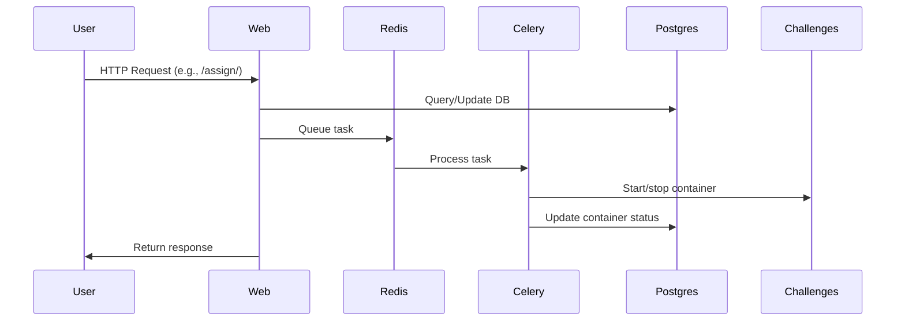

# CTF Challenge Management Web API - Docker Compose Integration

## 📘 Table of Contents
- [Docker Compose Setup](#docker-compose-setup)
- [Core Components](#core-components)
- [System Workflow](#-system-workflow) 
- [Quick Start](#-quick-start)
- [API Examples](#-api-examples)

---

## 🐳 Docker Compose Setup

```yaml
version: '3.8'

services:
  postgres:
    image: postgres:latest
    environment:
      - POSTGRES_USER=ctf_user
      - POSTGRES_PASSWORD=ctf_password
      - POSTGRES_DB=ctf_db
    volumes:
      - pgdata:/var/lib/postgresql/data

  redis:
    image: redis:latest

  web:
    build: .
    command: gunicorn --bind 0.0.0.0:8000 ctf_api.wsgi:application
    ports:
      - "8000:8000"
    depends_on:
      - postgres
      - redis

  celery:
    build: .
    command: celery -A ctf_api worker --loglevel=info
    volumes:
      - /var/run/docker.sock:/var/run/docker.sock
    depends_on:
      - postgres
      - redis

  challenge_todo:
    image: jetty:9.4-jre11-slim
    ports: ["14480:8080"]
    deploy: { replicas: 0 }

  challenge_juice:
    image: bkimminich/juice-shop
    ports: ["14528:3000"]
    deploy: { replicas: 0 }

volumes:
  pgdata:
```

---

## Core Components

| Service         | Role                                      | Key Details                                  |
|-----------------|-------------------------------------------|---------------------------------------------|
| **PostgreSQL**  | Persistent database for teams/challenges  | - Credentials: `ctf_user`/`ctf_password`<br>- Data persistence via `pgdata` volume |
| **Redis**       | Message broker for Celery tasks           | - Handles asynchronous container operations |
| **Web API**     | Django/Gunicorn HTTP server               | - Exposes port `:8000`<br>- Connects to PostgreSQL and Redis |
| **Celery**      | Async container management worker         | - Requires Docker socket access<br>- Starts/stops challenge containers |
| **Challenges**  | Pre-built CTF containers                  | - Start with 0 replicas (disabled by default)<br>- Fixed host ports: `14480` (Todo), `14528` (Juice Shop) |

---


## 🏗️ System Architecture

### Component Diagram


### Workflow Sequence


1. **User** makes API request to Web service
2. **Web** updates PostgreSQL and queues task in Redis
3. **Celery** processes task and manages containers
4. **Status updates** flow back through the chain

---

## 🚀 Quick Start

```bash
# Start services
docker-compose up --build

# Apply migrations
docker-compose exec web python manage.py migrate

# Create test team (in Django shell)
docker-compose exec web python manage.py shell
>>> from challenges.models import Team
>>> Team.objects.create(team_id="team1", name="Alpha Team")
```

---

## 📡 API Examples

### Assign Challenge
```bash
curl -X POST http://localhost:8000/api/assign/ \
  -d '{"team_id": "team1", "challenge_id": "todo"}' \
  -H "Content-Type: application/json"
```

### List Active Containers
```bash
curl http://localhost:8000/api/list/
```

### Remove Challenge
```bash
curl -X DELETE http://localhost:8000/api/remove/ \
  -d '{"team_id": "team1", "challenge_id": "todo"}' \
  -H "Content-Type: application/json"
```
---

## 🎥 Video Demonstration

📎 [Click here to view the video](https://iutbox.iut.ac.ir/)

> Shows:
>
> * Run `docker-compose up --build` and `docker ps`.
> * Assign Team1 (Todo) and Team2 (Juice) via Postman, check `docker ps`.
> * Remove Team2 (Juice) via Postman, verify removal.
> * Show `docker logs ctf_celery_1` for container logs.


