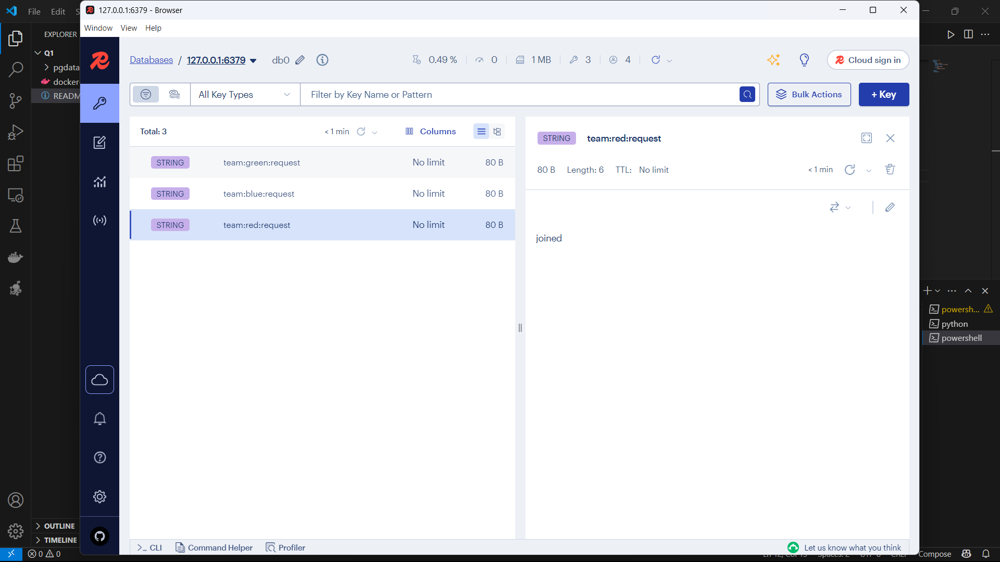

# Redis Server Setup and Pub/Sub Interaction

## Prerequisites

- Docker installed  
- Docker Compose installed  
- Python 3.8+ installed  
- `redis-py` library  

Install the Python client:

```bash
pip install redis
```

---

## Directory Structure

```
project-root/
├── docker-compose.yml
├── requester.py      # Sends join requests to Redis
└── listener.py       # Listens for join requests from Redis
```

---

## 1. Docker Compose Configuration

Create or update `docker-compose.yml`:

```yaml
services:
  redis:
    image: redis:7
    container_name: ctf_redis
    ports:
      - "6379:6379"
    volumes:
      - redisdata:/data

volumes:
  redisdata:
```

- **image: redis:7**: Uses the official Redis version 7 image.  
- **ports**: Maps container port 6379 to host port 6379, so your host tools (and Python scripts) can connect to `localhost:6379`.  
- **volumes**: Persists Redis data in a Docker volume named `redisdata`.

Start Redis:

```bash
docker-compose up -d
```

- `-d` runs the container in detached mode (background).

Verify Redis is running:

```bash
docker ps --filter name=ctf_redis
```

---

## 2. Requester Script (`requester.py`)

This script sends a "join request" for a given team:

```python
import redis
import sys

if len(sys.argv) != 2:
    print("Usage: python requester.py <team_id>")
    sys.exit(1)

team_id = sys.argv[1]
r = redis.Redis(host='localhost', port=6379, decode_responses=True)

r.set(f"team:{team_id}:request", "joined")

message = f"{team_id} requests to join"
r.publish("team_requests", message)

print(f"Sent request: {message}")

```

**Explanation of commands and arguments:**

- `redis.Redis(host='localhost', port=6379, decode_responses=True)`:  
  - `host`: Redis server address (localhost).  
  - `port`: Redis server port (6379).  
  - `decode_responses=True`: Automatically decodes byte responses into strings.  
- `r.set(key, value)`: Sets a string key-value pair in Redis (here: `"team:<team_id>:request"` = `"joined"`).  
- `r.publish(channel, message)`: Publishes a `message` to the given `channel` (`team_requests`).

Run the script:

```bash
python requester.py red
```

---

## 3. Listener Script (`listener.py`)

This script listens for join requests:

```python
import redis

r = redis.Redis(host='localhost', port=6379, decode_responses=True)
pubsub = r.pubsub()
pubsub.subscribe("team_requests")

print("Listening for team requests on channel 'team_requests'...")

for item in pubsub.listen():
    if item['type'] == 'message':
        team_message = item['data']  
        print(f"Received: {team_message}")
        
        team_id = team_message.split()[0]
        status = r.get(f"team:{team_id}:request")
        print(f"Status key for '{team_id}': {status}\n")

```

**Key parts explained:**

- `r.pubsub()`: Creates a Pub/Sub object for subscribing to channels.  
- `pubsub.subscribe("team_requests")`: Subscribes to the channel named `team_requests`.  
- `pubsub.listen()`: Listens indefinitely for incoming messages; each `item` has `type` (e.g., `"subscribe"` or `"message"`) and `data`.  

Run the listener:

```bash
python listener.py
```

---

## 4. Testing the Workflow

1. **Start Redis** (if not already running):
   ```bash
   docker-compose up -d
   ```
2. **Run the listener**:
   ```bash
   python listener.py
   ```
3. **Send a request**:
   ```bash
   python requester.py blue
   ```
4. **Observe output**:
   - In the listener terminal:
     ```
     Listening for team requests on channel 'team_requests'...
     Received: blue requests to join
     Status key for 'blue': joined
     ```

---

## Monitoring Redis Activity with RedisInsight

Once RedisInsight is connected to your Redis server, you can watch keys and real-time Pub/Sub messages:

1. **Key Browser**  
   – In the **Browser** tab you can see all current keys.  
   – Selecting `team:red:request` shows its value (`joined`) in the panel on the right.

2. **Pub/Sub Monitor**  
   – In the **Pub/Sub** tab you can subscribe to the `team_requests` channel.  
   – Every time a message is published (e.g. `"red requests to join"`), it appears here instantly.



---
🎥 [Watch the video](https://iutbox.iut.ac.ir/index.php/s/nGpMR9c4xGQ9LRM)

