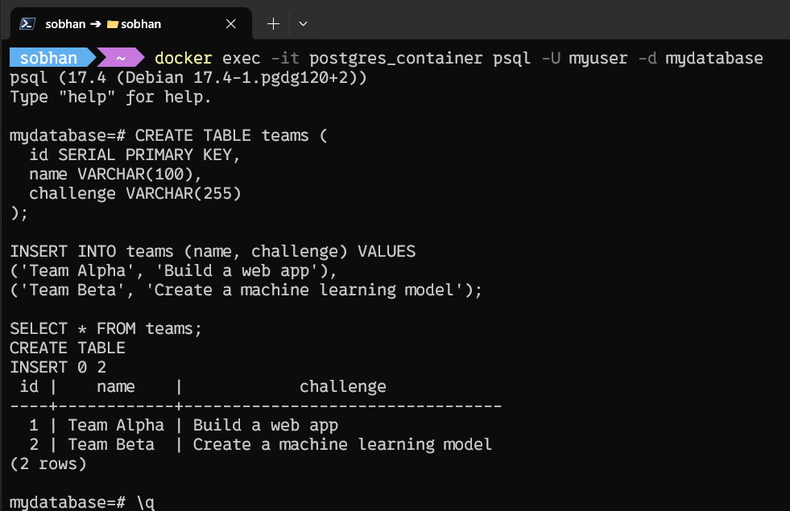

https://dl2.downloadly.ir/Files/Elearning/Udemy_Python_Django_The_Practical_Guide_2024-11_Downloadly.ir.part4.rar# Question 1

## Create a volume
```docker
docker volume create pgdata
```
## Run PostgreSQL container with persistent storage
```docker
docker run --name postgres_container `
  -e POSTGRES_PASSWORD=mysecretpassword `
  -e POSTGRES_USER=myuser `
  -e POSTGRES_DB=mydatabase `
  -v pgdata:/var/lib/postgresql/data `
  -p 5432:5432 `
  -d postgres
```
## SQL Commands: Run inside the PostgreSQL container
### Enter PostgreSQL shell 
```docker
docker exec -it postgres_container psql -U myuser -d mydatabase
```
### Inside PostgreSQL Shell, run the SQL commands
```sql
CREATE TABLE teams (
  id SERIAL PRIMARY KEY,
  name VARCHAR(100),
  challenge VARCHAR(255)
);

INSERT INTO teams (name, challenge) VALUES
('Team Alpha', 'Build a web app'),
('Team Beta', 'Create a machine learning model');

SELECT * FROM teams;

```


## Stop/remove container: Run in PowerShell
```docker
docker stop postgres_container
docker rm postgres_container
```
## Reconnect & Check Data: Use PowerShell then run SQL in the PostgreSQL shell
```docker
docker exec -it postgres_container psql -U myuser -d mydatabase
```
```sql
SELECT * FROM teams;
```