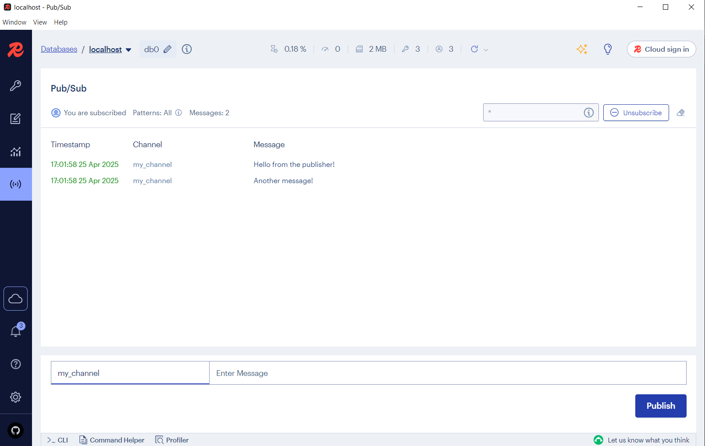

# Question 2

## Deploy Redis Server in Docker
### Launch a Redis Server in Docker
```docker
docker run --name redis_container -p 6379:6379 -d redis
```
### Verify Redis is Running
```docker
docker ps
```
This should us redis_container running

## Communicate through Redis Using Python
### Install Redis Python Client
```
pip install redis
```
### Python Program 1 – Set Key-Value Pairs and Publish Messages
```
python publisher.py
```
### Python Program 2 – Retrieve Key-Value Pairs and Subscribe to Channel
```
python subscriber.py
```


## Connect RedisInsight to Our Redis Server
### Monitor Data and Messages in RedisInsight

### Monitor Messages
