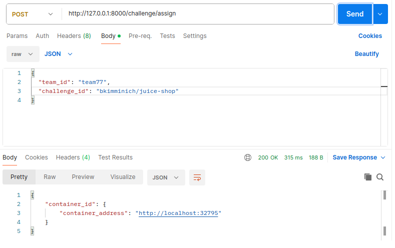
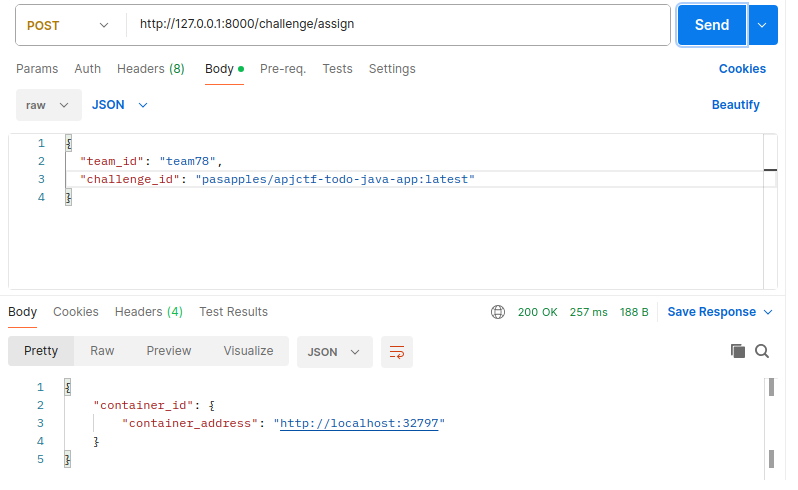
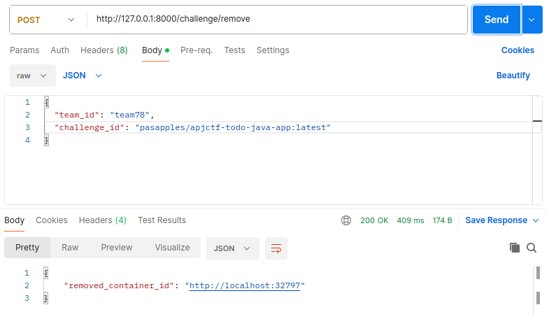
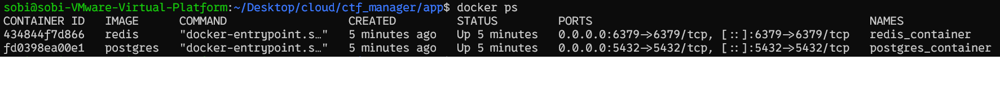

# Problem 4: Web API for Team Challenge Management
## Folder Structures 
```
ctf_manager/
│
├── app/
│   ├── main.py               # FastAPI app entry point
│   ├── models.py             # SQLAlchemy models
│   ├── database.py           # DB session/engine config
│   ├── celery_worker.py      # Celery app config
│   ├── tasks.py              # Celery background tasks
│   └── routers/
│       └── challenge.py      # API endpoints
│
├── requirements.txt

```

## Running the Services
### Start PostgreSQL
``` docker
docker run --name postgres_container \
  -e POSTGRES_PASSWORD=mysecretpassword \
  -e POSTGRES_USER=myuser \
  -e POSTGRES_DB=mydatabase \
  -v pgdata:/var/lib/postgresql/data \
  -p 5432:5432 \
  -d postgres
```
### Start Redis
```docker
docker run --name redis_container -p 6379:6379 -d redis 
```
### Run Celery
```docker
celery -A app.celery_worker.celery worker --loglevel=info
```
### Run FastAPI
```
uvicorn app.main:app --reload
```

#### For running celery adn FastAPI 
create python environment
```
python3 -m venv venv
source venv/bin/activate
```

## Postman
### Start bkimminich/juice-shop

### Start pasapples/apjctf-todo-java-app:latest
 
### docker ps
 

 ### Remove bkimminich/juice-shop

 ### Remove pasapples/apjctf-todo-java-app:latest 
 
 ### docker ps
 