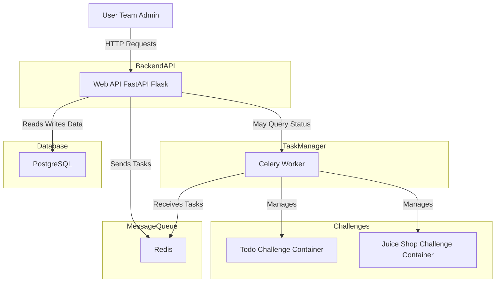

# Capture The Flag (CTF) Infrastructure Documentation

## Overview

This project implements a full-stack infrastructure for running web-based Capture The Flag (CTF) challenges using Docker containers. The system manages two vulnerable applications — a Todo Java app and OWASP Juice Shop — which are assigned to different teams. The infrastructure ensures isolated, persistent, and scalable environments using PostgreSQL, Redis, Celery, and a FastAPI backend API.

---

## Docker Compose Configuration

```yaml
version: '3.9'

services:
  db:
    image: postgres:13
    restart: always
    environment:
      POSTGRES_USER: ZahraNaderi
      POSTGRES_PASSWORD: zahra
      POSTGRES_DB: ctf_db
    volumes:
      - postgres_data:/var/lib/postgresql/data
    networks:
      - ctf_net

  redis:
    image: redis:6
    restart: always
    ports:
      - "6379:6379"
    networks:
      - ctf_net

  api:
    build:
      context: .
      dockerfile: Dockerfile.api
    container_name: fastapi_app
    ports:
      - "8000:8000"
    environment:
      - DATABASE_URL=postgresql://ZahraNaderi:zahra@db:5432/ctf_db
      - REDIS_URL=redis://redis:6379/0
      - DOCKER_HOST=unix:///var/run/docker.sock
    volumes:
      - .:/code
      - /var/run/docker.sock:/var/run/docker.sock
    depends_on:
      - db
      - redis
    networks:
      - ctf_net

  worker:
    build:
      context: .
      dockerfile: Dockerfile.worker
    container_name: celery_worker
    depends_on:
      - redis
      - db
    environment:
      - DATABASE_URL=postgresql://ZahraNaderi:zahra@db:5432/ctf_db
      - REDIS_URL=redis://redis:6379/0
      - DOCKER_HOST=unix:///var/run/docker.sock
    volumes:
      - .:/code
      - /var/run/docker.sock:/var/run/docker.sock
    networks:
      - ctf_net

  adminer:
    image: adminer
    restart: always
    ports:
      - 8080:8080
    networks:
      - ctf_net

  redisinsight:
    image: redis/redisinsight:latest
    container_name: redisinsight
    restart: always
    ports:
      - "5540:5540"
    networks:
      - ctf_net

volumes:
  postgres_data:

networks:
  ctf_net:
```

---
##How Services Are Connected and How to Run the System

This system consists of several Docker containers that work together to provide a scalable and efficient CTF challenge platform:

- PostgreSQL stores all persistent data, including teams, challenges, and container mappings.

- Redis acts as a message broker, facilitating communication between the API and Celery worker.

- Celery Worker runs background tasks such as starting and stopping challenge containers asynchronously.

- Web API (FastAPI/Flask) provides HTTP endpoints to assign or remove challenges for teams, interacts with the database, and sends tasks to Celery via Redis.

- Challenge Containers (e.g., Todo App and Juice Shop) are dynamically created and managed by Celery based on API requests.

All services are connected through a Docker network to allow seamless communication.

---


## System Architecture



---

## How Services are Connected

- **PostgreSQL** stores persistent data about teams, challenges, and container assignments.
- **Redis** acts as a message broker for task queuing between the API and Celery workers.
- **Celery Worker** runs asynchronous tasks to start and stop challenge containers based on API requests.
- **FastAPI Web API** provides endpoints to assign and remove challenges for teams, communicating with PostgreSQL and Redis.
- **Challenge Containers** (Todo app and Juice Shop) are dynamically created and removed by Celery tasks.
- **Adminer** allows database management via a web interface.
- **RedisInsight** provides a GUI for monitoring Redis activity.

All these services run inside Docker containers orchestrated by Docker Compose on a shared network (`ctf_net`) to ensure seamless communication.

---

## How to Start and Use the System

1. **Start the system** by running:

   ```bash
   docker-compose up --build
   ```

2. **Access the Web API** at `http://localhost:8000`.

3. **Assign a challenge container to a team** using POST requests to:

   ```
   POST /api/assign/
   {
     "team_id": "team2",
     "challenge_id": "juice"
   }
   ```

4. **Remove a challenge container from a team** by sending a POST request to the removal endpoint (e.g., `/api/remove/`).

5. **Monitor PostgreSQL** using Adminer at `http://localhost:8080`.

6. **Monitor Redis** using RedisInsight at `http://localhost:5540`.

7. **Celery workers** run in the background to handle container lifecycle tasks asynchronously.

---

## Test Cases

- Assign Juice Shop challenge to Team14:

  ```json
  POST /api/assign/
  {
    "team_id": "team14",
    "challenge_id": "juice"
  }
  ```

- Assign Todo App challenge to Team15:

  ```json
  POST /api/assign/
  {
    "team_id": "team15",
    "challenge_id": "todo"
  }
  ```

---

## Summary

This infrastructure provides a scalable and efficient environment for CTF competitions, automating container management with Celery tasks and ensuring persistent data storage with PostgreSQL. Redis provides fast messaging for background task processing. The system is fully containerized and managed through Docker Compose for easy deployment and operation.

---

*This documentation was generated as part of the Docker CTF assignment.*
